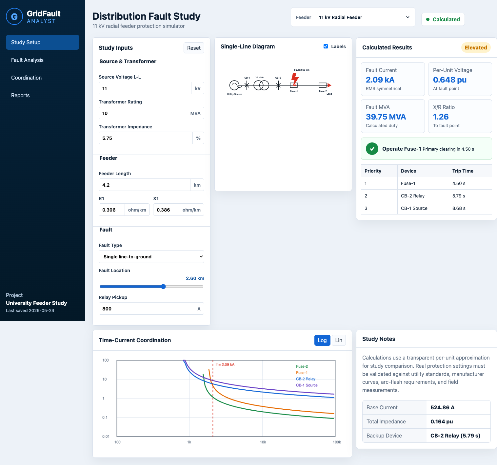
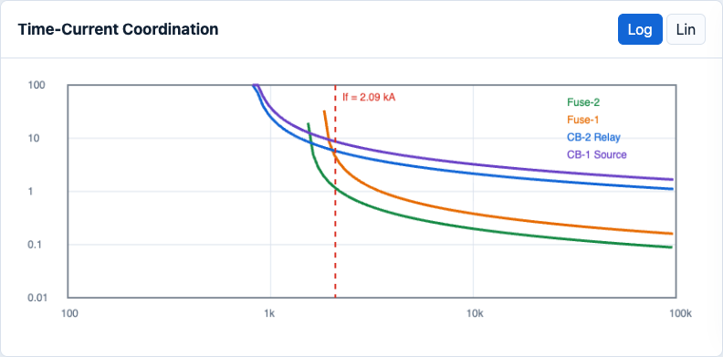

# GridFault Analyst

GridFault Analyst is a no-hardware power engineering portfolio project for
fault-current study and protection-coordination exploration on an 11 kV radial
distribution feeder.

The project combines a browser dashboard with a small Python calculation layer.
It is designed to show electrical engineering judgment, transparent formulas,
testable code, and clean product presentation without requiring lab equipment.

## Features

- Live fault-current calculation for three-phase, line-to-line, and
  single-line-to-ground studies
- Per-unit base current, base impedance, feeder impedance, and fault MVA
- Protection-device priority with inverse-time trip estimates
- Interactive single-line diagram with movable fault marker
- Canvas time-current coordination chart
- CSV report export utility
- Python unit tests and GitHub Actions CI

## Screenshots

Dashboard:



Time-current coordination graph:



## Quick Start

Open the dashboard directly:

```bash
open index.html
```

Or run a local web server:

```bash
python3 -m http.server 5174
```

Then visit:

```text
http://127.0.0.1:5174
```

## Run Tests

```bash
python3 -m unittest discover -s tests -v
```

## Export A Sample Report

```bash
PYTHONPATH=. python3 tools/export_fault_report.py
```

This writes:

```text
reports/sample_fault_study.csv
```

## Calculation Scope

This project uses a transparent per-unit approximation suitable for portfolio
demonstration and comparative study:

- Base current: `S / (sqrt(3) * V)`
- Base impedance: `V^2 / S`
- Total impedance: transformer/source impedance plus feeder impedance to the
  fault location
- Fault-type multipliers are used when full sequence-network data is not
  available

Real protection studies require validated network data, manufacturer time-current
curves, utility standards, protection grading margins, and field verification.

## Repository Structure

```text
.
├── app.js
├── index.html
├── styles.css
├── src/
│   ├── gridfault_calculations.py
│   └── gridfault_reports.py
├── tests/
├── tools/
├── data/
├── reports/
└── docs/
```

## Author

Raymond Mokolo, Graduate Engineer
